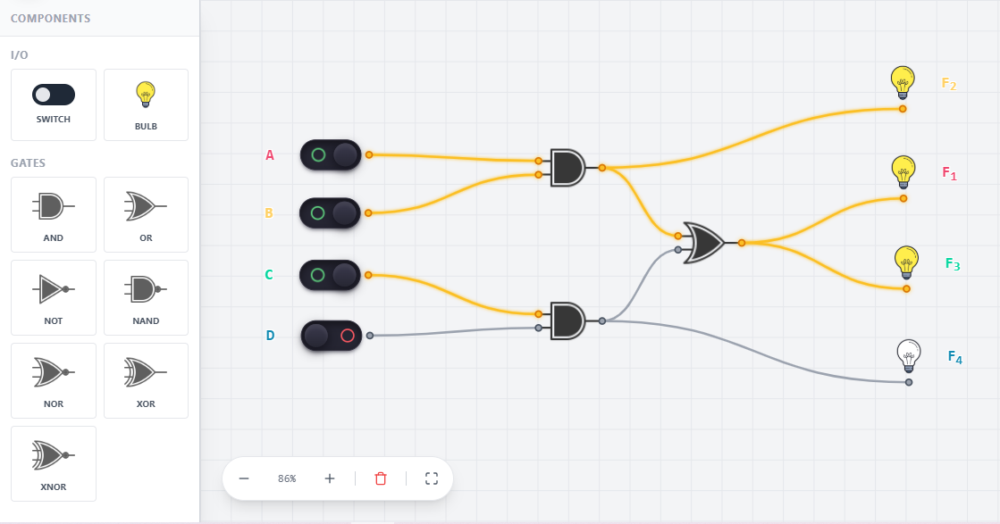

# 🟄 NERO 
> **A Canvas-Based Boolean Logic Builder — Listen to the Bits.**
Nero is a generative environment where discrete logic meets algorithmic composition. 
Design complex circuits, analyze truth tables, and hear your logic come to life.

[ Launch Canvas ] • [ Documentation ] • [ Sample Soundscapes ]

---

### ⚡ The Workflow
1. **Layout:** Wire up gates on an infinite, grid-less canvas.
2. **Simulate:** Watch the bits pulse through your traces in real-time.
3. **Compose:** Assign logic outputs to oscillators to generate unique audio sequences.

Canvas ---> Table ---> Expressions ---> Music 

---

### 🔌 Sample Circuit

---

### 🎵 How It Sounds

> ▶ [Listen to the sample circuit soundscape](audio/sample_circuit.mp3)

*The output bits of the circuit above are mapped to oscillators — each logic state generates a unique tone sequence.*

---

### Author
Ahmad Sohaib Qasim  
[LinkedIn](https://linkedin.com/in/asqasim)
